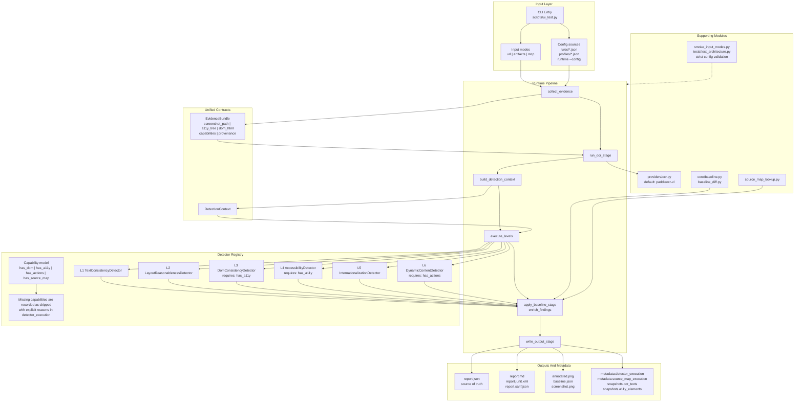

# PaddleOCR UI Test Skill

> AI-driven UI testing skill combining PaddleOCR screenshot analysis with DOM/Accessibility Tree cross-validation.

[中文文档](README.zh-CN.md)

## Quick Install

```bash
npx skills add aotenjou/paddleOCR-UI-test --skill paddleocr-ui-test
```

## Overview

Traditional UI testing tools have blind spots:

| Approach | Tools | Core Defect |
|----------|-------|-------------|
| Pixel comparison | Playwright `toHaveScreenshot`, Percy | Only detects "different", can't understand "what's wrong, why" |
| DOM/A11y Tree | axe-core, Playwright a11y | Only analyzes structure, can't verify "what the user actually sees" |

PaddleOCR bridges the gap between "pixels" and "semantics" — extracting structured UI information from screenshots (text content, position, layout relationships), enabling AI Agents to "understand" screenshots like humans do.

## Architecture

Source: [docs/architecture.mmd](docs/architecture.mmd)



### Runtime Pipeline

The runtime now follows a strict staged pipeline in `scripts/core/pipeline.py`:

1. `collect_evidence`: normalize `url`, `artifacts`, or `mcp` inputs into one `EvidenceBundle`
2. `run_ocr_stage`: call the selected OCR provider and optionally capture before/after OCR for `L6`
3. `build_detection_context`: construct the shared `DetectionContext`
4. `execute_levels`: run built-in detectors with capability checks
5. `apply_baseline_stage` and `enrich_findings`: append regression findings and optional source-map locations
6. `write_output_stage`: emit `report.json` and derived formats

### Capability Model

Each evidence bundle carries `capabilities` such as:

- `has_dom`
- `has_a11y`
- `has_actions`
- `has_source_map`

Detectors declare required capabilities in `scripts/engines/`. Missing requirements do not fail silently; they are recorded in `report.json -> metadata.detector_execution` as skipped detectors with explicit reasons.

## Installation

### Recommended (`npx skills`)

Install from GitHub:

```bash
npx skills add aotenjou/paddleOCR-UI-test --skill paddleocr-ui-test
```

Global non-interactive install for OpenCode:

```bash
npx skills add aotenjou/paddleOCR-UI-test --skill paddleocr-ui-test -g -a opencode -y
```

Global non-interactive install for Claude Code:

```bash
npx skills add aotenjou/paddleOCR-UI-test --skill paddleocr-ui-test -g -a claude-code -y
```

List available skills in the repository:

```bash
npx skills add aotenjou/paddleOCR-UI-test --list
```

### Manual

Copy or symlink the repository root to one of:
- `~/.agents/skills/paddleocr-ui-test/`
- `~/.claude/skills/paddleocr-ui-test/`
- `.claude/skills/paddleocr-ui-test/` (project-local)

## Prerequisites

```bash
pip install openai playwright Pillow
playwright install chromium
export SILICONFLOW_API_KEY="your-api-key"
```

## Usage

Trigger by mentioning: "test UI", "check screenshot", "verify UI", "visual regression", "OCR test", etc.

Or run directly:

```bash
# Minimal: just URL
python3 scripts/ui_test.py --url https://example.com

# With profile (auto-sets levels, viewport, rules)
python3 scripts/ui_test.py --url https://example.com --profile form

# With specific expected texts
python3 scripts/ui_test.py --url https://example.com --config test-config.json --annotate

# Full suite with annotated screenshot
python3 scripts/ui_test.py --url https://example.com --levels L1,L2,L3,L4,L5 --annotate

# Consume pre-captured artifacts (dev-browser / Playwright MCP output)
python3 scripts/ui_test.py --input-mode artifacts --artifacts-dir ./artifacts --source playwright-mcp

# Consume MCP payload JSON (path-based payload v1)
python3 scripts/ui_test.py --input-mode mcp --input-json ./mcp-payload.json --source ui-test-generation-mcp
```

### MCP Payload (v1 path-based)

```json
{
  "source": "playwright-mcp",
  "url": "https://example.com",
  "viewport": "1280x720",
  "screenshot_path": "./artifacts/screenshot.png",
  "a11y_tree_path": "./artifacts/a11y_tree.json",
  "dom_path": "./artifacts/dom.html"
}
```

### 5 Control Knobs

| Knob | Parameter | Description |
|------|-----------|-------------|
| Test Scope | `--levels` | L1-L6, default L1,L3 |
| Page Type | `--profile` | saas/ecommerce/form/content/dashboard/mobile |
| Rule Tuning | `rules/*.json` | Adjust thresholds, strategies, toggles |
| Specific Expectations | `--config` | Expected texts, language, etc. |
| Regression Compare | `--baseline` | Save baseline or diff against history |

### Config Contract

- `rules/*.json`, `profiles/*.json`, and runtime `--config` are validated against explicit allowed keys.
- Unknown runtime config keys now fail fast instead of being silently ignored.
- Profile and runtime config merge into a single execution config before detector execution.

## Test Levels

| Level | Scenario | Method |
|-------|----------|--------|
| L1 | Text consistency | OCR vs expected text (exact/substring/fuzzy) |
| L2 | Layout reasonableness | Overflow, overlap, touch target size |
| L3 | DOM consistency | OCR vs A11y Tree cross-validation |
| L4 | Accessibility | Missing alt/labels, canvas text, emoji icons |
| L5 | Internationalization | Language detection (zh/en/ja/ko) |
| L6 | Dynamic content | Action sequences + screenshot comparison |

## Project Structure

```
paddleOCR-UI-test/
├── SKILL.md                          # Agent instructions (5 control knobs)
├── skill.json                        # Skill metadata
├── README.md                         # English docs
├── README.zh-CN.md                   # Chinese docs
├── LICENSE                           # Apache-2.0
├── rules/                            # Data-driven rules (6 files, with agent_hints)
│   ├── text-consistency.json         # L1: match strategies, thresholds, ignore patterns
│   ├── layout-anomaly.json           # L2: overflow, overlap, touch targets
│   ├── dom-ocr-crossval.json         # L3: fuzzy matching, count mismatch
│   ├── accessibility.json            # L4: alt, labels, canvas, emoji
│   ├── i18n.json                     # L5: language patterns, false positives
│   └── dynamic-content.json          # L6: state transitions, tracking
├── profiles/                         # Industry presets (6 files, with when_to_use)
│   ├── saas.json                     # Backend management systems
│   ├── ecommerce.json                # E-commerce websites
│   ├── form.json                     # Login/registration forms
│   ├── content.json                  # Blogs/articles
│   ├── dashboard.json                # Data dashboards
│   └── mobile.json                   # Mobile H5 pages
├── scripts/
│   ├── ui_test.py                    # Thin CLI orchestrator
│   ├── smoke_input_modes.py          # Lightweight adapter smoke checks
│   ├── compare_ocr_dom.py            # Standalone OCR vs DOM validator (--ci)
│   ├── baseline_diff.py              # Baseline regression engine
│   ├── annotate_screenshot.py        # Annotated screenshot generator
│   ├── source_map_lookup.py          # Source code location resolver
│   ├── core/                         # Shared contracts and runtime pipeline
│   │   ├── models.py                 # EvidenceBundle, Issue, DetectionContext, execution records
│   │   ├── config.py                 # Strict rules/profile/runtime-config loading and merging
│   │   ├── pipeline.py               # collect_evidence/run_ocr/... staged runtime
│   │   ├── reporting.py              # Unified report payload + json/markdown/junit/sarif writers
│   │   ├── baseline.py               # Baseline creation and diff logic
│   │   ├── a11y.py                   # Shared a11y tree flattening
│   │   └── text_utils.py             # Shared OCR/DOM text matching utilities
│   ├── engines/                      # Built-in L1-L6 detectors and capability-aware registry
│   │   ├── base.py                   # Detector base class and descriptors
│   │   └── registry.py               # execute_levels + detector metadata
│   ├── providers/                    # OCR provider abstraction (default: paddleocr-vl)
│   │   └── ocr.py                    # Provider registry and provider descriptors
│   └── adapters/                     # Input adapters
│       ├── base.py                   # Input adapter base contract
│       ├── registry.py               # Input-mode detection + adapter descriptors
│       ├── standalone_url.py         # Playwright-based live capture
│       ├── artifact_dir.py           # Filesystem artifact bundle loader
│       └── mcp_payload.py            # Path-based MCP payload loader
├── references/
│   ├── ocr-api.md                    # PaddleOCR API configuration
│   ├── a11y-tree.md                  # Accessibility tree format
│   └── test-patterns.md              # Common test patterns + CI/CD example
├── tests/
│   └── test_architecture.py          # Architecture, capability, and report-contract regression tests
└── examples/
    └── test-config.json              # Test config example
```

## Integration

This skill is designed to work alongside other UI testing skills:

- **dogfood**: Exploratory testing → discoveries become `expected_texts` config → this skill guards against regressions
- **dev-browser**: Browser automation → navigates pages → this skill validates the final state
- **ui-ux-pro-max**: Design system → defines expected UI → this skill verifies implementation matches design

### Current Execution Model

- Built around one internal evidence contract rather than separate pipelines for each input mode.
- Backward compatible: existing `--url` workflow still works.
- Adds downstream-friendly modes for external captures:
  - `--input-mode artifacts --artifacts-dir <dir>`
  - `--input-mode mcp --input-json <file>`
- `L6 --actions` is supported in `url` mode only.
- `report.json` is the canonical output payload; markdown, JUnit, and SARIF are derived from it.

### Output and Provider Extensions

- New report formats: `--format junit`, `--format sarif`, or `--format all`
- OCR backend is now provider-based: `--ocr-provider paddleocr-vl`
- `report.json` now includes:
  - `snapshots.ocr_texts`
  - `snapshots.a11y_elements`
  - `metadata.detector_execution`
  - `metadata.source_map_execution`
- `baseline_diff.py` can consume normalized `report.json` snapshots directly for regression comparison

See `SKILL.md` for the full integration protocol including input/output contracts and collaboration modes.

## CI/CD Integration

```yaml
# .github/workflows/ui-test.yml
name: UI Test
on: [push]
jobs:
  ui-test:
    runs-on: ubuntu-latest
    steps:
      - uses: actions/checkout@v4
      - name: Setup Python
        uses: actions/setup-python@v5
        with:
          python-version: "3.11"
      - name: Install dependencies
        run: |
          pip install openai playwright Pillow
          playwright install chromium
      - name: Run UI tests
        env:
          SILICONFLOW_API_KEY: ${{ secrets.SILICONFLOW_API_KEY }}
        run: |
          python3 scripts/ui_test.py \
            --url https://staging.example.com \
            --levels L1,L3 \
            --config tests/ui-config.json \
            --output test-results \
            --format json
      - name: Upload results
        uses: actions/upload-artifact@v4
        with:
          name: ui-test-results
          path: test-results/
```

## License

Apache-2.0. See [LICENSE](LICENSE).
